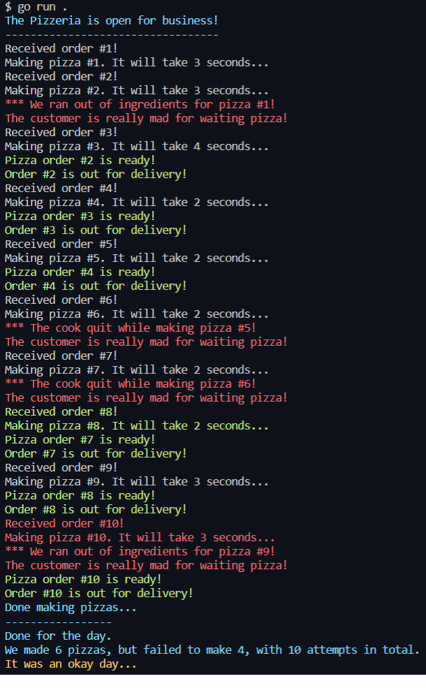

# Producer Consumer Problem

## Channel

<span>
Go 언어의 channel은 goroutine 간에 메시지를 전달하는 메시지 큐 역할을 합니다

channel을 사용하면 WaitGroup이나 Mutex를 사용하지 않고도 

한쪽에서 channel로 데이터를 푸시하고, 

다른 한쪽에서는 channel에 데이터가 들어오는 것을 대기하도록 하여

손쉽게 동시성을 제어할 수 있습니다
</span>

## Channel을 사용한 생상자-소비자 문제 해결

<span>
아래의 코드는 피자 가게에서 발생하는 생상자-소비자 문제를 해결하는 과정입니다


1. 손님(소비자)의 주문이 들어오면

2. 점원(생산자)이 피자를 만들어 channel에 집어넣고

3. 기다리고 있던 손님은 완성된 피자를 가져간다
   

goroutine과 channel을 사용하면 생산자가 생산한 물건을 channel에 저장하고

소비자는 물건이 생산될 때까지 대기하고 있다가 생산된 물건을 가져감으로써

생산자-소비자의 동시성 문제를 해결할 수 있습니다
</span>

```go
package main

import (
	"fmt"
	"math/rand"
	"time"

	"github.com/fatih/color"
)

const NumberOfPizzas = 10 // 최대 10개의 피자 생산

var pizzasMade, pizzasFailed, total int // 성공, 실패, 전체 생산한 개수

// 생산자
type Producer struct {
	data chan PizzaOrder // 생산된 피자를 전달하는 channel
	quit chan chan error // 당일 피자 가게 마감 여부
}

// 피자 주문
type PizzaOrder struct {
	pizzaNumber int // 피자 번호
	message     string
	success     bool // 성공 여부
}

// 피자 가게 마감
func (p *Producer) Close() error {
	ch := make(chan error)
	p.quit <- ch
	return <-ch
}

// 피자 만들기
func makePizza(pizzaNumber int) *PizzaOrder {
	pizzaNumber++
	if pizzaNumber <= NumberOfPizzas {
		delay := rand.Intn(5) + 1
		fmt.Printf("Received order #%d!\n", pizzaNumber)

		rnd := rand.Intn(12) + 1
		msg := ""
		success := false

		if rnd < 5 {
			pizzasFailed++
		} else {
			pizzasMade++
		}
		total++

		fmt.Printf("Making pizza #%d. It will take %d seconds...\n", pizzaNumber, delay)

		time.Sleep(time.Second * time.Duration(delay))

		if rnd <= 2 {
			msg = fmt.Sprintf("*** We ran out of ingredients for pizza #%d!", pizzaNumber)
		} else if rnd <= 4 {
			msg = fmt.Sprintf("*** The cook quit while making pizza #%d!", pizzaNumber)
		} else {
			success = true
			msg = fmt.Sprintf("Pizza order #%d is ready!", pizzaNumber)
		}

		return &PizzaOrder{
			pizzaNumber: pizzaNumber,
			message:     msg,
			success:     success,
		}
	}
	return &PizzaOrder{
		pizzaNumber: pizzaNumber,
	}
}

// 피자 가게 오픈
func pizzeria(pizzaMaker *Producer) {
	// 만들어야 하는 피자 번호
	var i = 0

	// quit channel로 종료 알림이 들어올 때까지 반복문 실행
	for {
		currentPizza := makePizza(i) // 피자 생산
		if currentPizza != nil {
			i = currentPizza.pizzaNumber
            // 여러 개의 채널에 대해 동시에 작업을 진행하는 경우 select문을 사용
			select {
			// data channel에 생산된 피자 정보를 푸시
			case pizzaMaker.data <- *currentPizza:

			// 피자 가게 마감
			case quitChan := <-pizzaMaker.quit:
				close(pizzaMaker.data) // 사용이 끝난 채널은 닫아주는 것이 좋다
				close(quitChan)
				close(pizzaMaker.quit)
				return
			}
		}
	}
}

func main() {
	// 유사 난수 생성기
	rand.Seed(time.Now().UnixNano())

	// 피자 가게 오픈
	color.Cyan("The Pizzeria is open for business!")
	color.Cyan("----------------------------------")

	// 점원(생산자) 정의
	pizzaJob := &Producer{
		data: make(chan PizzaOrder),
		quit: make(chan chan error),
	}

	// 점원은 피자 가게 주방에서 goroutine으로 근무
	go pizzeria(pizzaJob)

    // 손님(소비자)은 for문으로 피자 생산을 대기
	for i := range pizzaJob.data {
		if i.pizzaNumber <= NumberOfPizzas {
			if i.success {
				color.Green(i.message)
				color.Green("Order #%d is out for delivery!", i.pizzaNumber)
			} else {
				color.Red(i.message)
				color.Red("The customer is really mad for waiting pizza!")
			}
		} else {
			color.Cyan("Done making pizzas...")
			if err := pizzaJob.Close(); err != nil {
				color.Red("*** Error closing kitchen!", err)
			}
		}
	}

	// print out the ending message
	color.Cyan("-----------------")
	color.Cyan("Done for the day.")

	color.Cyan("We made %d pizzas, but failed to make %d, with %d attempts in total.", pizzasMade, pizzasFailed, total)

	switch {
	case pizzasFailed > 9:
		color.Red("It was an awful day...")
	case pizzasFailed >= 6:
		color.Red("It was not a very good day...")
	case pizzasFailed >= 4:
		color.Yellow("It was an okay day...")
	case pizzasFailed >= 2:
		color.Yellow("It was a pretty good day!")
	default:
		color.Green("It was a great day!`")
	}
}
```

## Output

