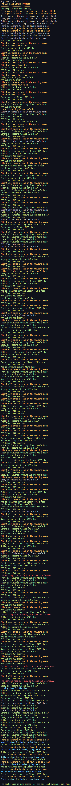

# The Sleeping Barber - 잠자는 이발사

## Channels

1. goroutine 사이의 소통 수단
2. buffered channel로 여러 개의 값을 동시에 받을 수 있다
3. channel 사용이 끝나면 반드시 닫아줘야 한다 (resource leak 발생!)
4. channel은 생성할 때 주어진 타입 또는 인터페이스에 해당하는 값만 받을 수 있다

## 고전 컴퓨터 과학 문제2

1. 이발사는 웨이팅룸에 고정된 개수의 좌석이 있는 바버샵으로 출근을 합니다
2. 만약 웨이팅룸에 대기하는 사람이 아무도 없다면, 이발사는 낮잠을 잡니다
3. 손님이 바버샵에 들어왔을 때, 웨이팅룸에 좌석이 남아있지 않다면 손님을 그대로 떠나갑니다

## The Sleeping Barber - Output

